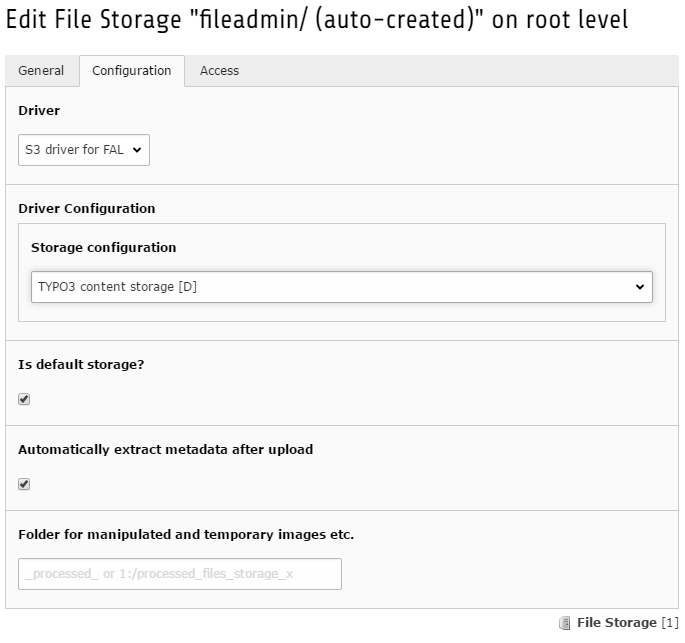

.. _administration:

==============
Administration
==============

Selecting the configuration to use
^^^^^^^^^^^^^^^^^^^^^^^^^^^^^^^^^^

Once the configuration is added to :code:`config/system/settings.php` the preferred storage can be selected within the backend of TYPO3 CMS.

Go to the `List` module and select the root page (pid:0). Click the storage you want to edit and select the `Configuration` tab.
Choose `S3 driver for FAL` as the driver for this storage. Next choose the storage configuration that should be used.
